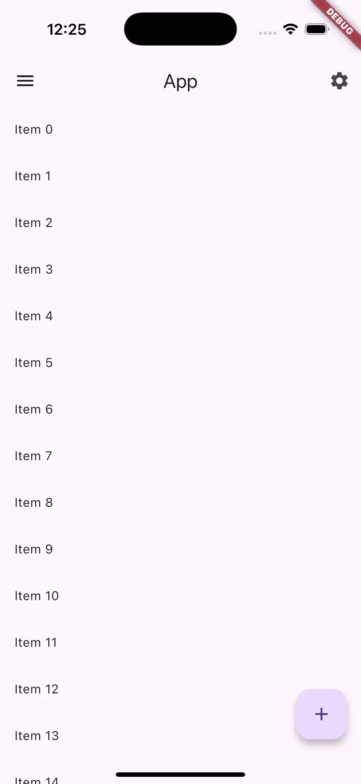

# Features Tour

A Flutter package for adding interactive tours to your app. Wrap your widgets with `FeaturesTour` and guide users through new or important features step by step.



## Demo

A live demo is available at [pub.lamnhan.dev/features_tour](https://pub.lamnhan.dev/features_tour).

## Installation

Add the package to your `pubspec.yaml`:

```yaml
dependencies:
  features_tour: ^0.4.13
```

Run `flutter pub get` to install the dependency.

## Quick start

1. **Create a controller** for each page that contains tours.

```dart
final tourController = FeaturesTourController('HomePage');
```

2. **Wrap widgets** in `FeaturesTour` and provide the introduction text and tour index.

```dart
FeaturesTour(
  controller: tourController,
  index: 0.0,
  introduce: const Text('This is TextButton 1'),
  child: TextButton(
    onPressed: () {},
    child: const Text('TextButton 1'),
  ),
)
```

3. **Start the tour** once the page is ready, typically from `initState`.

```dart
@override
void initState() {
  tourController.start(context);
  super.initState();
}
```

## Global configuration

Customize default styles and behaviour globally using `FeaturesTour.setGlobalConfig` before running the app:

```dart
void main() {
  FeaturesTour.setGlobalConfig(
    childConfig: ChildConfig(backgroundColor: Colors.white),
    nextConfig: NextConfig(text: 'NEXT'),
    skipConfig: SkipConfig(text: 'SKIP'),
    doneConfig: DoneConfig(text: 'DONE'),
  );
  runApp(const MaterialApp(home: MyApp()));
}
```

See the [`example`](example/lib/main.dart) directory for a full working demo.

## Contributions

Contributions are welcome! Feel free to open issues or submit pull requests.

## Donations

If you find this project helpful, consider supporting it:

- **PayPal:** [Donate](https://www.paypal.com/donate?hosted_button_id=lamnhan066)
- **Buy Me a Coffee:** [Link](https://www.buymeacoffee.com/lamnhan066)

Thank you for your support!


